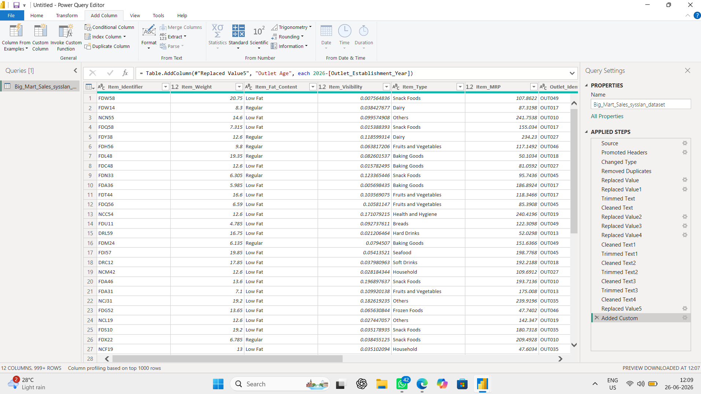

# Big Mart Retail Insights Dashboard

## Overview
This interactive Power BI dashboard provides insights into Big Mart retail sales by analyzing products, outlet performance, pricing, and product distribution.

## Features
- Interactive slicers for Item Type and Outlet Type
- KPI Cards (Total Products, Average MRP, Item Visibility, Item Weight, Total Categories, Total Outlets)
- Histogram for Price Distribution
- Donut Chart for Item Fat Content
- Bar Charts for Product Categories and Average MRP
- Stacked Column Chart for Outlet Location and Size
- Product Details Table

## Tools Used
- Power BI Desktop
- Power Query
- DAX
- Excel

## Power Query Editor

The dataset was cleaned and transformed using Power Query before building the dashboard. Data preprocessing included handling missing values, correcting data types, removing duplicates, and preparing the dataset for analysis.

## Dashboard Preview

## Author
Sangeetha
